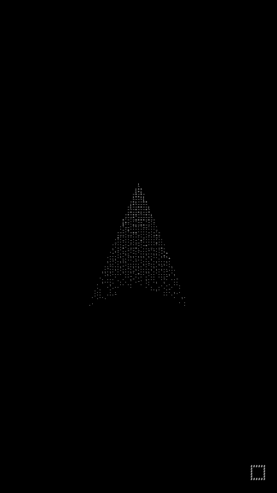
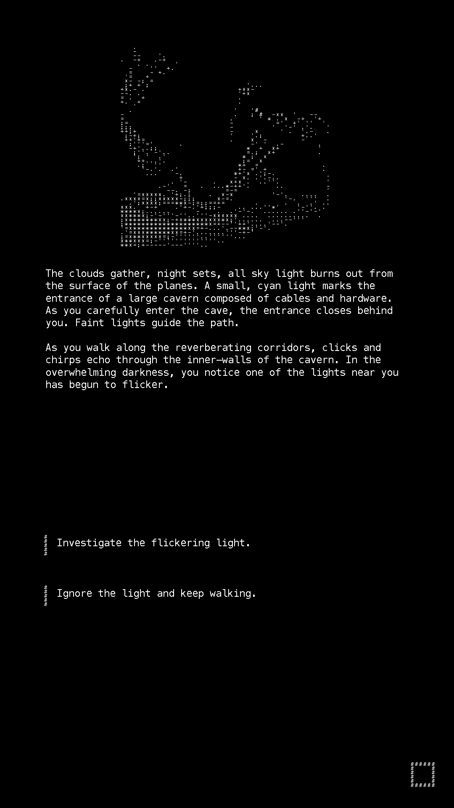

# Final Prototype Presentation

## What is your concept?

_Elyium_ is an experimental mobile alternate reality game and narrative platform. The player is put inside a world filled with 'entities' from various realms, each with their own sets of branching stories to tell. Within the in-world narrative, the player's phone acts as a conduit to _Elyium_, the limbo world, granting them access to the infinite planes. As they walk around in the physical realm, they come accross new entities, which are saved in the player's database. Using their real-world coordinats, as well as those of recorded entities, players can revisit old places to find new experiences.

Aside from being a story-centered game, _Elyium_ is also a storytelling format. The experience described above works regardless of the content of each entity's branching stories, meaning that anyone can create content for their own instance of _Elyium_. All content (entities, their stories, each story's choices, the ties between different stories, and custom real-world locations for entities) is written within a few `.json` files, making writing for this format relatively user friendly.

## How did you move through your iterations?

Initially, I had a pretty clear plan of what I wanted to make, and a semi-clear plan of how I wanted to make it. I was focused on the experience that I wanted the player to have. Over the course of this project, I found myself progressing into a slightly reversed situation.

Now, reaching the point where _Elyium_ is nearly entirely playable, I find myself adding new features and additional story-telling tools, with the purpose of providing a platform, much more than providing a specific user-experience.

The reason for this is due to the fact that _Elyium_ is a tool that I wanted to make so that I could experiment with narrative, and try different formats of storytelling. I eventually reached a point where the product was what I wanted it to be, but through various suggestions from classmates, friends, and coworkers, I found that it'd be much more interesting if I expanded it to allow for a higher degree of exploration in terms of story formats.

So, my development experience is divided into 3 main parts.

First, I wanted to explore narrative as a concept, and to learn more about stories and world-building through designing a narrative-centric experience. So, I spent my time designing the data management and narrative systems for _Elyium_.

Then, I wanted to take advantage of the mobile-ness of phones to create a compelling connection between the real world, and a fictional one. So, I spent my time creating the entity spawning system, and messing around with interesting ways to localize fictional entities.

Finally, I wanted to make all of this available to others, so that everyone can use this format to tell their own stories. So, I spent my time simplifying the writing format and increasing the complexity of my parsing system, as well as including custom save file management to allow for even more control over entities.

In the end, _Elyium_ came out better than I ever could have initially imagined it to be.

## Any design/research-creation insights?

In terms of programming, I significantly expanded my object-oriented skills. This is most definitely the most complex project I've made thus far, and with that came many challenges.

For one, creating large objects that communicate between one-another in a variety of ways was hard to plan out. Looking at my UML diagram, and looking at how things have turned out, I can confidently say that I had no idea how to make this. I now have a much better idea of how different objects should communicate, and it's easier for me to see the data-flow and structural hierarchy of a system.

Also, dealing with JSON files and creating more dynamic data structures that are filled with the JSON file data was entirely foreign to me, and proved to be a huge roadblock. 'Databases', in general, were things I was unfamiliar with at the beginning of this project. Now it's easier for me to wrap my head around parsing files and creating more intricate data structures.

In regards to design and more artsy matters, the majority of the insight is related to narrative. In a panic to create a bit of content for _Elyium_, I asked everyone I knew about how to write good stories. The suggestions I got encouraged me to expand on _Elyium_'s functionalities to allow for a wider array of stories, including things like custom entity locations and conflict resets.

Most importantly, however, I learned about narrative design as a discipline. What I was most scared of was making the experience feel dumb, or plain boring. One of the things that helped with that was trying to expand on what was already working. Having entities connected to real-world locations is pretty cool, but why stop the connection between real and fictional there? The first entity you encounter, the Void; it's not just something you come accross in the game world, but it acts as a hub. And the only way you can visit it is by turning off your location tracking, which I absolutely love as a feature.

Currently, I'm still learning a lot about narrative through writing for _Elyium_, but what I've learned has given me great insight on how to introduce the worldly context of a fictional universe into the interaction design and systems of a product.

## Screenshots

### Idle

### Narrative

### Menu
